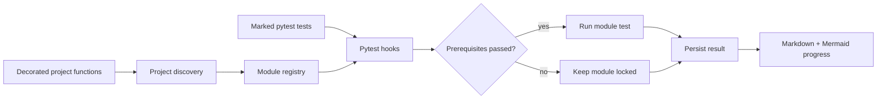

# Learning Framework 🎓

> **Build educational projects with dependency-based progression tracking**

An educational framework that enables instructors to create hands-on learning experiences where students implement functions step-by-step, with automatic dependency tracking, progress visualization, and smart test management.

[](https://www.python.org/downloads/)
[](./LICENSE)

## 🌟 Features

- **🎯 Smart Dependency Tracking** - Define which functions depend on others
- **✅ Automated Test Management** - Tests only run when dependencies are satisfied  
- **📊 Visual Progress Tracking** - Auto-generated Markdown files with Mermaid diagrams
- **🔒 Intelligent Locking** - Students can only work on modules where prerequisites are complete
- **💾 Progress Persistence** - Test results saved across sessions

## 🚀 Quick Start

**For Students:**
```bash
python -m framework.cli status    # Check your progress
pytest                            # Run tests (auto-updates progress.md)
python -m framework.cli next      # See what to work on next
```

**For Educators:**
1. Add project to `projects/<your_project>/`
2. Decorate functions with `@module(dependencies=[], difficulty="easy")`
3. Write tests with `@pytest.mark.tests_module("function_name")`
4. That's it! Framework handles the rest.

## 📚 Creating a Project

### Define Learning Modules

```python
from framework.decorators import module

@module(dependencies=[], difficulty="easy")
def create_connection():
    """Create database connection."""
    raise NotImplementedError("Students implement this")

@module(dependencies=["create_connection"], difficulty="medium")
def create_user_table():
    """Create users table."""
    raise NotImplementedError("Students implement this")
```

### Write Tests

```python
import pytest

@pytest.mark.tests_module("create_connection")
def test_create_connection():
    conn, cursor = create_connection()
    assert conn is not None

@pytest.mark.tests_module("create_user_table")  
def test_create_user_table():
    create_user_table()
    # Test implementation
```

**Important:** Every `@module` must have a corresponding test marked with `@pytest.mark.tests_module("function_name")`

## 🎯 How It Works

1. **Auto-Discovery** - Scans `projects/` and imports all modules
2. **Dependency Enforcement** - Tests only run when prerequisites pass
3. **Progress Tracking** - Results saved in `.learning_framework/test_results.json`
4. **Auto-Visualization** - `progress.md` regenerates after every `pytest` run in each project directory



## 📊 Progress Visualization

Each project gets `projects/<project_name>/progress.md` with:
- Progress bar and statistics
- Color-coded modules: 🟢 Complete | 🟧 Available | 🔴 Locked
- Mermaid dependency diagram
- Suggested next steps

**View Mermaid diagrams:** Install [VS Code Mermaid extension](https://marketplace.visualstudio.com/items?itemName=bierner.markdown-mermaid) or view on GitHub.

## 🔧 Installation

```bash
git clone https://github.com/xzaviourr/dependency-aware-learning-framework.git
cd dependency-aware-learning-framework
python3 -m venv .venv
source .venv/bin/activate
pip install -e .
```

## 📖 Example Project

Check [projects/movie_recommendation_system](projects/movie_recommendation_system) for a complete example with database setup and similarity search modules.

## 🛠️ CLI Commands

```bash
python -m framework.cli status           # Show module status
python -m framework.cli next             # Get suggested modules
python -m framework.cli path             # View learning path
python -m framework.cli reset --all      # Reset progress
python -m framework.cli reset --module <name>  # Reset specific module
```

## Project Structure

```text
framework/
  decorators.py          module metadata and registry
  project_discovery.py   project import and discovery
  test_tracker.py        persisted pass/fail state
  visualization.py       progress report and dependency graph
  cli.py                 status, next, path, and reset commands
projects/
  movie_recommendation_system/  worked learning project and tests
conftest.py              pytest collection, locking, and result hooks
```

## Testing

```bash
pytest -q
```

The included movie-recommendation project is intentionally a learning
exercise: incomplete modules can fail or remain locked until their
dependencies pass. To perform a dependency-free source check, run:

```bash
python -m compileall -q framework projects conftest.py
```

## Project Status and Limitations

This is an early-stage framework with one example project. Module identity is
currently based on function names in a global registry, so projects should
avoid duplicate decorated names. Discovery imports project modules and may
execute their module-level code. Progress is stored locally under
`.learning_framework/`; reset it before distributing a clean exercise.

## 📄 License

Released under the [MIT License](./LICENSE).
